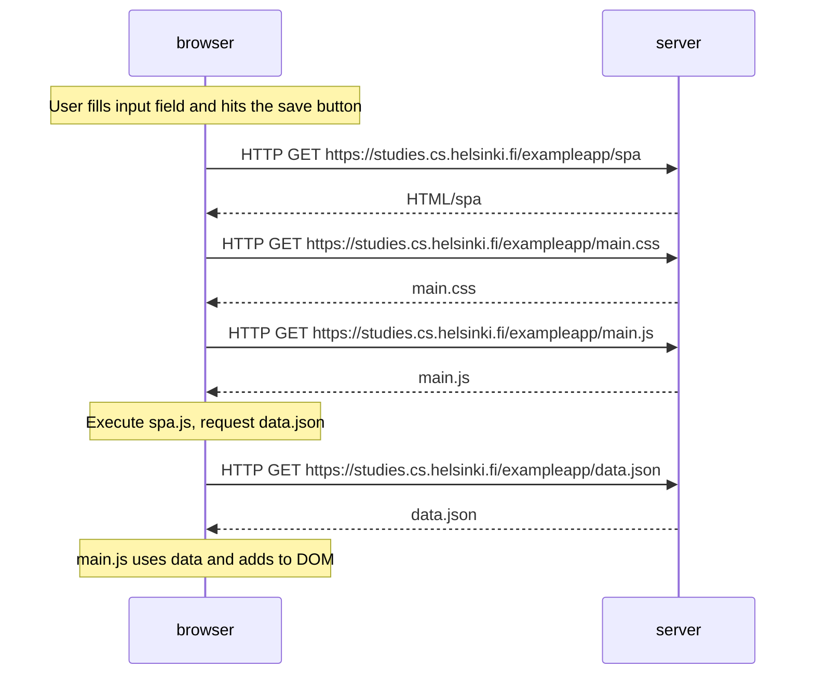

```mermaid
sequenceDiagram
    participant browser
    participant server

    Note over browser: User fills input field and hits the save button
    browser->>server: HTTP GET https://studies.cs.helsinki.fi/exampleapp/spa
    server-->>browser: HTML/spa
    browser->>server: HTTP GET https://studies.cs.helsinki.fi/exampleapp/main.css
    server-->>browser: main.css
    browser->>server: HTTP GET https://studies.cs.helsinki.fi/exampleapp/main.js
    server-->>browser: main.js
    Note over browser: Execute spa.js, request data.json
    browser->>server: HTTP GET https://studies.cs.helsinki.fi/exampleapp/data.json
    server-->>browser: data.json
    Note over browser: main.js uses data and adds to DOM
```